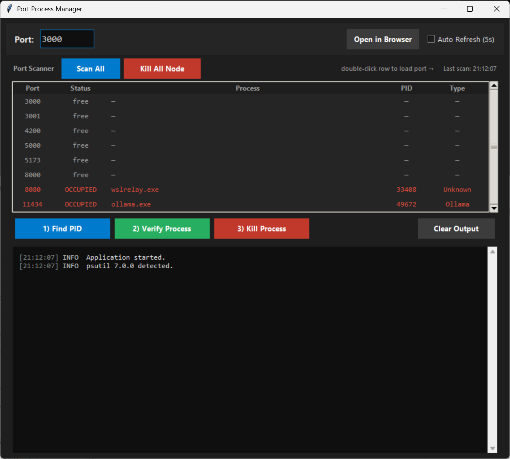
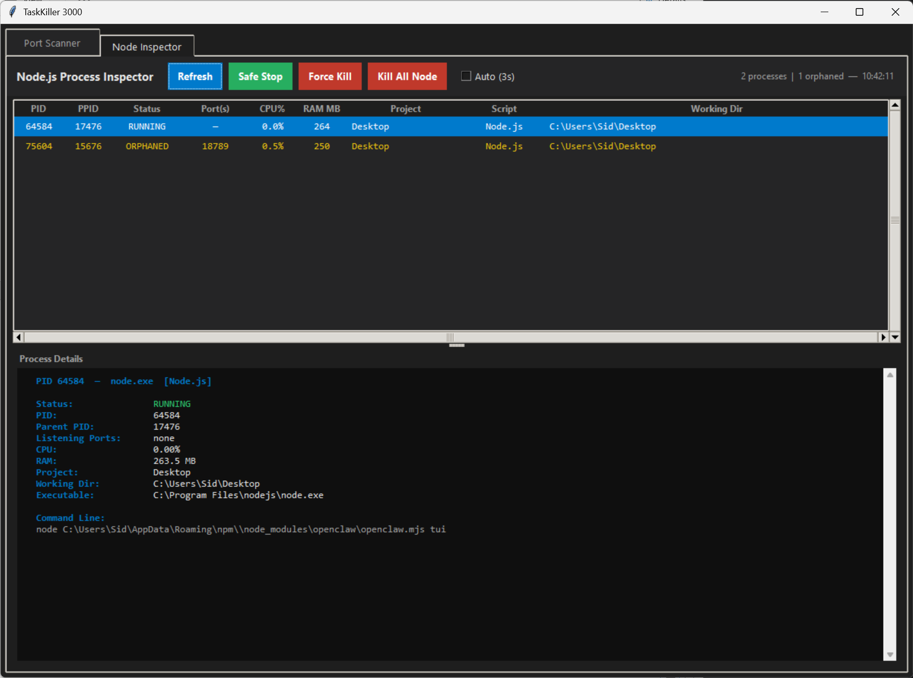

# TaskKiller 3000

A Windows desktop utility for developer process management. Identify, inspect, and kill processes holding localhost ports — with deep visibility into Node.js environments before you terminate anything.

Built with Python and Tkinter — no web stack, no Electron, no external UI frameworks.

---

## Screenshots

### Port Scanner



Port scanner on startup — 8080 (`wslrelay.exe`) and 11434 (`ollama.exe`) detected as OCCUPIED. Double-click any red row to load it into the Find → Verify → Kill workflow below.

### Runtime Inspector



Runtime Inspector tab showing active Node.js and Python dev processes side-by-side. Node.js rows in green, Python rows in blue. Columns include project name, script type (Vite, Next.js, Uvicorn, Flask, MCP Server, etc.), listening ports, CPU/RAM, and virtual environment. Orphaned processes highlighted in yellow.

---

## Requirements

| Requirement | Version |
|---|---|
| Python | 3.10 or newer |
| OS | Windows 10 / 11 |
| tkinter | Bundled with Python (no install needed) |
| psutil | Optional for Port Scanner — **required for Node Inspector** |

> **Why Python 3.10?**  
> The app uses `int | None` union type syntax introduced in Python 3.10. It will not start on older versions.

### Check your Python version

```
python --version
```

---

## Installation

### 1. Clone or download

```
git clone https://github.com/SidSpanos/taskkiller-3000.git
cd taskkiller-3000
```

Or download and extract the ZIP from GitHub.

### 2. Install psutil (recommended)

Without `psutil`, Port Scanner falls back to `tasklist` (less process detail). Node Inspector requires psutil — it will show a notice if missing.

```
pip install psutil
```

Or install from the requirements file:

```
pip install -r requirements.txt
```

### 3. No other dependencies required

`tkinter`, `subprocess`, `os`, `re`, `webbrowser` are all Python standard library.

---

## How to run

**Option A — Python directly:**

```
python port_manager.py
```

**Option B — Batch launcher:**

```
run_port_manager.bat
```

Double-clicking `run_port_manager.bat` also works from Explorer.

---

## Features

The application has two tabs: **Port Scanner** and **Runtime Inspector**.

---

### Tab 1: Port Scanner

#### Port Scanner dashboard
- Scans 8 common dev ports simultaneously in a single `netstat` pass
- Shows Port / Status / Process / PID / Type in a live table
- `OCCUPIED` rows highlighted in red, protected system processes in yellow
- Double-click any occupied row → loads port into entry and runs Find PID automatically
- **Scan All** button for manual refresh; auto-refresh checkbox (5s) for live monitoring

#### Process Detail (3-step workflow)
- **1) Find PID** — runs `netstat -ano`, extracts the LISTENING process on the port
- **2) Verify Process** — shows name, executable path, command line, and status
- **3) Kill Process** — runs `taskkill /F /PID` after confirmation dialog

#### Process classification
Recognizes and labels: Node.js, Python, Ollama, Docker, Java, Electron, Bun, Browser, Unknown

#### Protected process safety
Hard blocks termination of critical Windows processes (`svchost`, `lsass`, `csrss`, `explorer`, `dwm`, `winlogon`, and others). Shows an error dialog — no confirmation prompt is ever shown for protected processes.

#### Other
- Manual port entry (press Enter to search)
- Kill all `node.exe` processes shortcut
- Open port in default browser
- Kill success auto-refreshes the scanner
- Dark theme with color-coded process names in log output

---

### Tab 2: Runtime Inspector

Unified view of all active dev runtime processes — Node.js and Python in a single table. Shows what each process actually is, what project owns it, and whether it is healthy, before you decide to terminate it.

**Node.js rows are shown in green. Python rows are shown in blue.**

#### Process table

| Column | Description |
|---|---|
| Runtime | `Node.js` or `Python` |
| PID | Process ID |
| PPID | Parent process ID |
| Status | RUNNING, ORPHANED, or ZOMBIE |
| Port(s) | Listening ports owned by this process |
| CPU% | CPU utilisation (updated each refresh) |
| RAM MB | Resident memory in megabytes |
| Project | Resolved from `package.json`, `pyproject.toml`, or `setup.cfg` |
| Script | Detected framework or script type |
| Working Dir | Current working directory |

Click any column heading to sort ascending/descending.

#### Node.js script detection

| Script Type | Detected when command line contains |
|---|---|
| MCP Server | `mcp` |
| Vite | `vite` |
| Next.js | `next` |
| Nuxt | `nuxt` |
| Svelte | `svelte` |
| Remix | `remix` |
| Webpack | `webpack` |
| Nodemon | `nodemon` |
| ts-node | `ts-node`, `tsx` |
| Vitest | `vitest` |
| Jest | `jest` |
| Mocha | `mocha` |
| Express | `express` |
| Fastify | `fastify` |
| NestJS | `@nestjs` |
| Turborepo | `turbo` |
| Electron | `electron` |
| Storybook | `storybook` |
| TypeScript | `tsc` |
| esbuild | `esbuild` |
| Node.js | (anything else) |

#### Python script detection

Python processes are only shown if they have listening ports **or** match a recognized dev pattern — generic `python.exe` invocations without a port or known framework are hidden to avoid noise.

| Script Type | Detected when command line contains |
|---|---|
| Uvicorn | `uvicorn` |
| Gunicorn | `gunicorn` |
| Hypercorn | `hypercorn` |
| Daphne | `daphne` |
| Streamlit | `streamlit` |
| Gradio | `gradio` |
| Jupyter | `jupyter`, `notebook` |
| JupyterLab | `lab` |
| Flask | `flask` |
| FastAPI | `fastapi` |
| Django | `django`, `manage.py` |
| Celery | `celery` |
| pytest | `pytest` |
| MkDocs | `mkdocs` |
| HuggingFace | `huggingface` |
| LangChain | `langchain` |
| Python | (anything else with a port) |

#### Virtual environment detection (Python)

For Python processes, the inspector attempts to detect the active virtual environment by walking up from the executable path looking for `pyvenv.cfg` (the standard venv marker). If found, the venv directory name (e.g. `.venv`, `myenv`) is shown in the detail panel.

#### Project name detection

- **Node.js**: reads `package.json` → `name` field, walks up 2 directories
- **Python**: reads `pyproject.toml` → `[project] name`, then `setup.cfg` → `[metadata] name`, then `package.json`, then falls back to the folder name

#### Process detail panel

Select any row to see:

- Runtime type and status
- PID, parent PID, and child PIDs
- Listening ports
- CPU% and RAM
- Virtual environment name (Python only, if detected)
- Project name and working directory
- Full executable path
- Full untruncated command-line arguments
- Warnings for orphaned or zombie status

#### Orphaned process detection

A process is marked **ORPHANED** (yellow) when its parent PID no longer exists. Common causes:
- Terminal or shell closed without shutting down child processes
- Dev server spawned child workers and the parent crashed
- A process manager (PM2, nodemon) exited and left workers running

#### Zombie process detection

A process is marked **ZOMBIE** (red) when it has finished but has not been reaped by its parent. Zombie processes hold a PID slot and port entry but are no longer executing.

#### Safe Stop vs Force Kill

| Action | Command | Behaviour |
|---|---|---|
| **Safe Stop** | `taskkill /PID <pid>` (no `/F`) | Sends a graceful exit signal. Processes that handle shutdown events will flush logs and release ports cleanly. |
| **Force Kill** | `taskkill /PID <pid> /F` | Immediately terminates the process. Use this if Safe Stop does not work within a few seconds. |

Both actions show a confirmation dialog with runtime type, project name, script type, and affected ports before proceeding.

#### Kill All Node

Terminates every `node.exe` process on the machine at once (`taskkill /IM node.exe /F`). Available in both tabs. Shows a count before asking for confirmation.

#### Port detection

Port mapping uses `psutil.net_connections()` (LISTEN state only) with `netstat -ano` as fallback. Each process row shows all listening ports. No open port is shown as `—`.

#### Auto-refresh

**Auto (3s)** checkbox refreshes every 3 seconds. CPU% is tracked across refreshes — first tick shows `0.0%`, real values appear after the second tick.

Killing a process in the Runtime Inspector automatically refreshes the Port Scanner tab.

---

## Common development ports

All 8 ports are scanned by the Port Scanner dashboard automatically on startup.

| Port | Typical use |
|---|---|
| `3000` | Node.js, React (CRA), Express |
| `3001` | Secondary React dev server |
| `4200` | Angular CLI |
| `5000` | Flask, FastAPI |
| `5173` | Vite (React, Vue, Svelte) |
| `8000` | Django, generic HTTP |
| `8080` | Webpack, Java, generic HTTP |
| `11434` | Ollama (local AI) |

---

## LISTENING vs ESTABLISHED — what's the difference?

When you run `netstat -ano`, you'll see two types of connections on a port:

| Type | What it is | Should you kill it? |
|---|---|---|
| `LISTENING` | The **server** — the app that owns the port and waits for connections | **Yes** — this frees the port |
| `ESTABLISHED` | A **client** — e.g. a browser tab connected to the server | No — killing this only disconnects the client temporarily |

Port Process Manager only targets `LISTENING` entries.  
`ESTABLISHED` connections from Chrome, Edge, and Firefox are intentionally ignored.

**Example scenario:**

```
TCP  0.0.0.0:3000    0.0.0.0:0       LISTENING    12345   ← your Node server (kill this)
TCP  127.0.0.1:52341 127.0.0.1:3000  ESTABLISHED  67890   ← a browser tab (ignored)
```

---

## Troubleshooting

### "Port is in use" but app finds nothing

The process may have already exited. The port can linger briefly in `TIME_WAIT` state. Wait a few seconds and retry.

### "Access is denied" when killing

Run the app as Administrator:

1. Right-click `run_port_manager.bat` → **Run as administrator**  
   Or: right-click `python.exe` / your terminal → **Run as administrator**

Some system processes and services require elevated privileges to terminate.

### Runtime Inspector shows no processes

psutil is required. Install it:

```
pip install psutil
```

Then restart the application.

### Runtime Inspector CPU% shows 0.0% on first load

Expected. psutil's `cpu_percent` needs two measurements to calculate a delta. Enable **Auto (3s)** and real values appear after the first refresh tick.

### Python processes not appearing

Python processes are only shown when they have a listening port **or** match a recognized dev framework pattern (Uvicorn, Flask, Streamlit, etc.). Generic `python.exe` scripts without a port are filtered out by design.

### App shows a browser process on the port

Browsers show as `ESTABLISHED` (client), not `LISTENING` (server). If the app is reporting a browser as the LISTENING process, the actual server may have already exited and left a stale netstat entry. Restart your server.

### `python` is not recognized

Python is not on your PATH. Either:
- Use the full path: `C:\Users\you\AppData\Local\Programs\Python\Python312\python.exe port_manager.py`
- Or add Python to PATH during installation (check the box in the Python installer)

### psutil not available warning

Install it:

```
pip install psutil
```

The Port Scanner works without it using `tasklist` as fallback, but you'll get less process detail. Node Inspector is unavailable without psutil.

### App won't start — SyntaxError or TypeError on launch

You're on Python 3.9 or older. Upgrade to Python 3.10+.

---

## Project structure

```
taskkiller-3000/
├── port_manager.py           # Main application (single file)
├── run_port_manager.bat      # Windows launcher
├── requirements.txt          # psutil (optional)
├── .gitignore
├── README.md
├── CLAUDE.md                 # AI assistant instructions
├── PROJECT_STATE.md          # Project status and roadmap
├── screenshots/
│   ├── main.png              # Port Scanner tab
│   └── node-inspector.png    # Runtime Inspector tab
└── .github/
    └── workflows/
        ├── claude.yml                # Claude PR assistant
        └── claude-code-review.yml   # Claude code review
```

---

## Extensibility

The Runtime Inspector is built on a `DevProcessInspector` base class. Adding a new runtime (Ollama, Docker, Bun, Java) requires:

1. Subclass `DevProcessInspector`
2. Set `PROCESS_NAMES`, `RUNTIME_LABEL`, `DEFAULT_LABEL`, `SCRIPT_PATTERNS`
3. Optionally override `should_include()`, `_detect_project()`, `_detect_venv()`
4. Add the new inspector instance to `RuntimeInspectorPanel.inspectors`

No changes to the UI code are required.

---

## License

MIT
